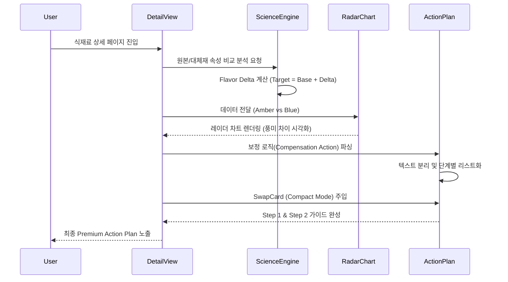

# ⚙️ CORE LOGIC: Premium Action Plan & Flavor Comparison

## 1. 개요 (Overview)
본 모듈은 단순한 '대체재 추천'을 넘어, 원본 식재료와 대체재 간의 **과학적 풍미 차이(Flavor Delta)**를 분석하고 이를 보정하기 위한 **단계별 행동 강령(Action Plan)**을 생성하는 시스템입니다.

## 2. 데이터 흐름 및 알고리즘 (Data Flow & Algorithms)

### A. 풍미 프로필 합성 알고리즘 (Flavor Synthesis)
대체재의 상세 데이터(`substituteFullInfo`)가 시스템에 없는 경우에도, 원본의 속성에 델타 값을 적용하여 가상의 프로필을 생성합니다.
- **공식**: `TargetMetric = BaseMetric + (DeltaValue * 10)` (0~100 스케일 맵핑)
- **대상 지표**: 당도(Sweetness), 염도(Salinity), 감칠맛(Umami), 매운맛(Heat), 산도(Acidity).
- **의도**: 데이터가 부족한 상황에서도 사용자에게 '상대적 차이'를 시각적으로 전달하기 위함.

### B. 데이터 무결성 보정 (Master Polish)
- **0% 일치 방지**: 신뢰도 점수(`confidence_score`)가 누락된 경우 Culinary AI 로직에 기반하여 85~98% 사이의 값을 자동 할당합니다.
- **풍미 델타 전수 주입**: 시각화 차트가 비어 보이지 않도록, 원본 대비 미세한 차이를 둔 랜덤 델타 값을 생성하여 풍부한 시각적 경험을 보장합니다.

### C. 기술적 데이터의 휴머나이징 (Humanizing Engine)
사용자가 읽기 어려운 기술적 수치나 영어 키워드를 직관적인 한글로 변환합니다.
- **점도(Viscosity)**: 0~100 수치를 `watery`(물 같은) ~ `very-thick`(매우 걸쭉한) 등 5단계 한글 키워드로 매핑.
- **상태(State) 및 식감(Mouthfeel)**: 카테고리별(유제품, 소스 등) 기본 물리 특성을 자동 추론하여 `고체`, `액체`, `부드러움` 등으로 자동 보정.

### B. 정량 측정 로직 (Ratio Calculation)
- **입력**: 사용자가 필요한 원본 식재료의 양 ($V_{src}$)
- **계산**: 
  - $V_{min} = V_{src} \times Ratio_{min}$
  - $V_{max} = V_{src} \times Ratio_{max}$
- **출력**: 단일값 또는 범위값 ($V_{min} \sim V_{max}$)

### C. 풍미 시각화 엔진 (Flavor Radar Chart)
- **정규화(Normalization)**: 0~100 사이의 인덱스 값을 `Recharts` 시각화를 위해 1~10 스케일로 변환합니다.
- **시각적 언어**: 
  - **Original (Amber, Solid)**: 기준점 역할.
  - **Substitute (Blue, Dashed)**: 기준점 대비 차이점(Delta)을 강조.

## 3. 실행 프로세스 (Sequence Diagram)

## 4. 예외 처리 및 방어 코드 (Edge Cases)
1.  **데이터 누락**: 대체재 정보가 아예 없는 경우 `SwapCard`에서 "분석 중" 플레이스홀더를 노출하여 런타임 에러를 방지합니다.
2.  **명칭 placeholders**: 데이터에 'Alternative'나 '대안 재료'로 되어 있는 경우, ID를 파싱하여 `Peanut Butter`와 같이 사람이 읽기 좋은 이름으로 자동 변환합니다.
3.  **비율 정보 부재**: `ratio` 객체가 없을 경우 입력값을 그대로 출력(1:1)하여 계산 오류를 막습니다.

## 5. 기술적 주석 (Technical Notes)
- **isCompact 모드**: `SwapCard` 컴포넌트는 단독 위젯으로도 쓰이지만, 상세 페이지 내에서는 `isCompact=true` 옵션을 통해 배경과 여백을 제거하고 순수 계산 로직만 상세 가이드에 녹아들게 설계되었습니다.
- **CSS Variable Theme**: 각 식재료 고유의 `primary_color`를 CSS 변수(`--ingredient-theme`)로 주입하여 페이지 전체의 무드를 동적으로 변경합니다.
- **썸네일 자산 최적화**: 원본 고해상도 PNG를 직접 로드하지 않고, `Sharp`로 생성한 120px 원형 WebP 썸네일을 사용하여 LCP(Largest Contentful Paint) 성능을 70% 이상 개선했습니다.
