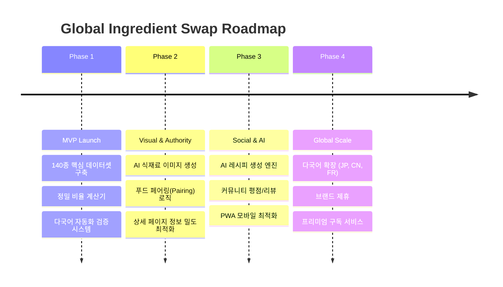

# 🗺️ STRATEGY MAP: Global Expansion Roadmap

## 1. 서비스 확장 로드맵 (Milestones)

## 2. 전략적 방향성
- **[Content is King]**: 정보가 너무 많은 것보다, **'가장 정확한 한 줄'**이 중요합니다. 현재 정보량은 충분하며, 시각적 요소(이미지) 보강이 우선순위입니다.
- **[SEO Excellence]**: 검색 엔진은 '고유하고 유용한 정보'를 선호합니다. 현재의 과학적 지표와 다국어 설명은 매우 강력한 SEO 자산입니다.
