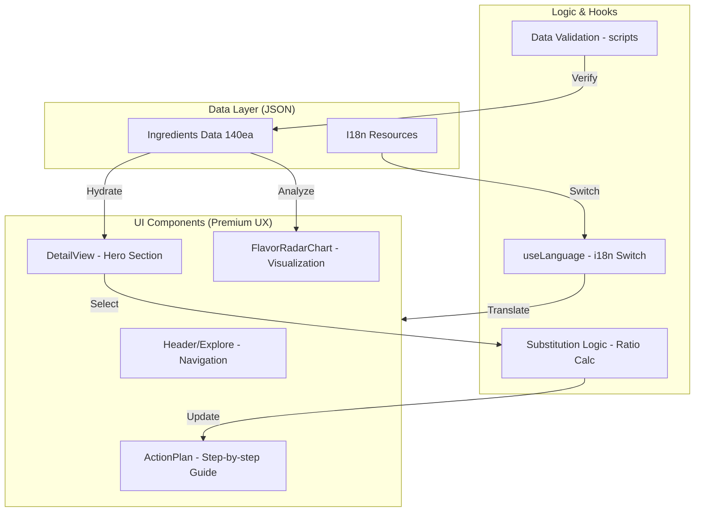

# 🗺️ SYSTEM MAP: Global Ingredient Swap

## 1. 프로젝트 개요
- **목적**: 전 세계 식재료의 대체재 정보를 제공하고, 과학적 풍미 지표를 기반으로 요리 보정 가이드를 제시하는 프리미엄 미식 플랫폼.
- **핵심 가치**: 데이터 무결성(i18n), 프리미엄 UX/UI, 시각적 풍미 분석.

## 2. 기술 스택 (Tech Stack)
- **Frontend**: Next.js 16.2.4 (App Router), React 19.2.4
- **Styling**: Tailwind CSS (UI/UX), Framer Motion (Animations)
- **Visualization**: Recharts (Radar Chart for Flavor Profile)
- **Data Management**: JSON-based Flat File System (140 Ingredients)
- **Automation**: Node.js scripts for i18n validation and batch updates
- **Deployment**: Vercel (Production)

## 3. 디렉토리 구조 (Directory Structure)
```text
/
├── .gravityBrain/          # 에이전트 장기 기억 및 작업 일지 (Source of Truth)
├── scripts/                # 데이터 자동화 및 자산 파이프라인
│   ├── validate-data.js    # 다국어 누락 및 플레이스홀더 검증
│   ├── generate-images.js  # NVIDIA NIM 기반 이미지 생성 엔진
│   ├── generate-thumbnails.js # Sharp 기반 원형 썸네일 생성
│   ├── master-polish.js    # 0% 일치 해결 및 풍미 데이터 보정
│   └── humanize-texture.js # 물리적 질감 한글화 엔진
├── src/
│   ├── app/                # 라우팅 및 SEO 설정 (Sitemap, RSS)
│   │   ├── explore/        # 식재료 탐색 및 상세 페이지
│   │   └── api/            # 이미지 생성 및 기타 서버리스 기능
│   ├── components/
│   │   ├── common/         # 공통 UI (Header, Footer, LanguageSwitcher)
│   │   └── swap/           # 핵심 비즈니스 UI (SwapCard, RadarChart, DetailView)
│   ├── lib/
│   │   ├── data/           # 140종 식재료 JSON 데이터셋
│   │   ├── i18n/           # 시스템 UI 다국어 (en, ko)
│   │   └── utils/          # 풍미 보정 및 계산 로직
│   └── hooks/              # 다국어 및 URL 상태 관리 커스텀 훅
├── public/                 # 정적 에셋 (Icons, Images)
│   ├── images/ingredients/ # AI 생성 원본 식재료 이미지 (140종)
│   └── images/thumbnails/  # 최적화된 원형 썸네일 (WebP)
└── package.json            # 의존성 및 데이터 검증 명령어 등록
```

## 4. 시스템 아키텍처 및 데이터 흐름 (Visualization)


## 5. 핵심 모듈 관계
- **IngredientDetailView**: 페이지의 컨트롤러 역할을 하며, `best_use_cases` 및 `FlavorRadarChart`를 조합하여 프리미엄 UX를 완성합니다.
- **scripts/validate-data**: 데이터의 질을 보장하는 Safety Net 역할을 수행하며, 배포 전 데이터 무결성을 최종 점검합니다.
- **FlavorRadarChart**: `Recharts`를 사용하여 원본과 대체재의 풍미 오버레이 시각화를 담당합니다.
